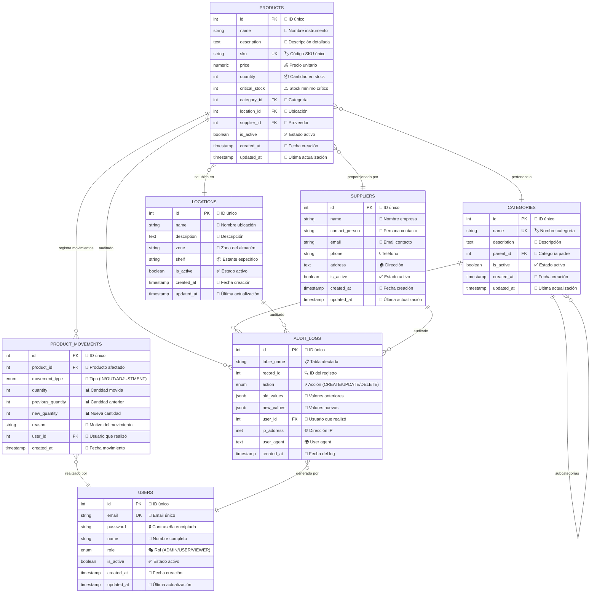
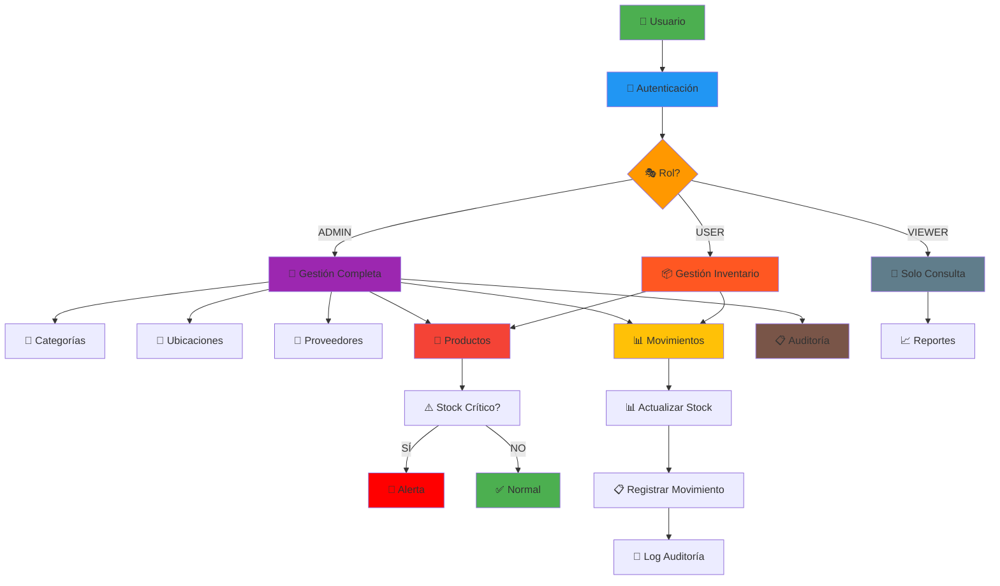
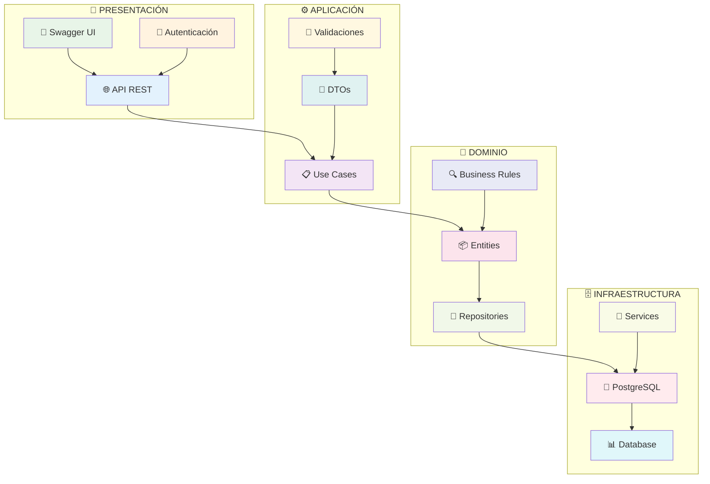
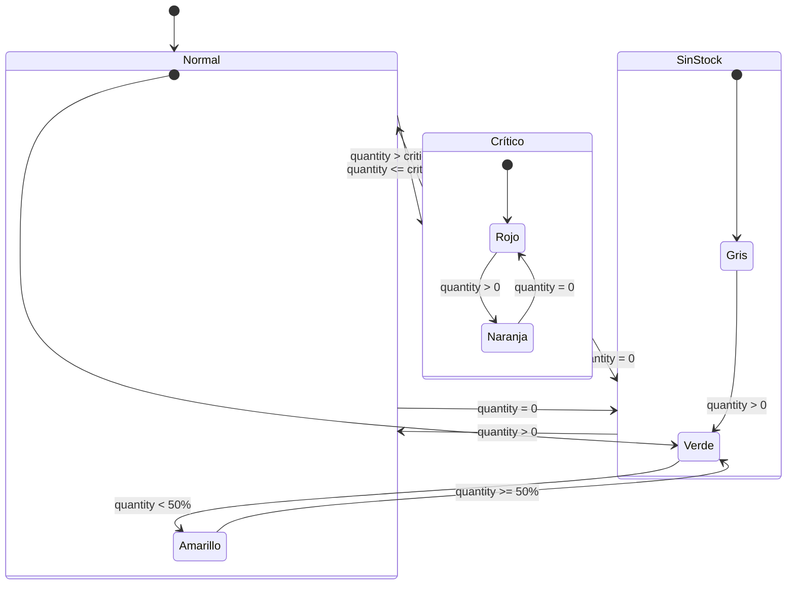
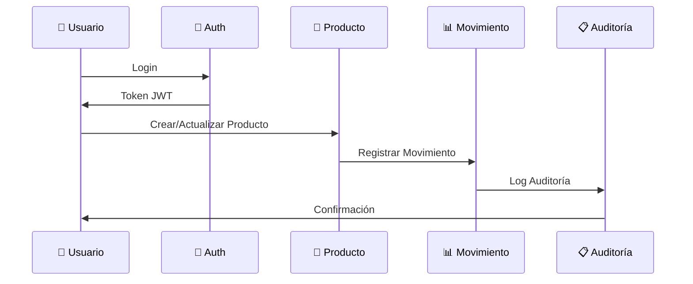
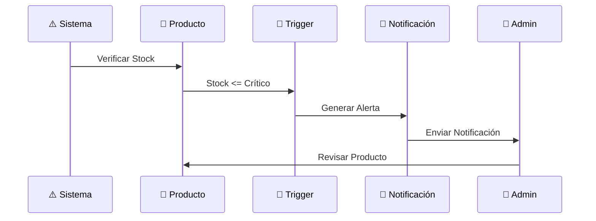

# 🎨 Esquema Visual de Base de Datos - Sistema de Inventario Industrial

## 🗺️ Diagrama ERD (Entity Relationship Diagram)

---

## 🎯 **Explicación Visual por Colores**

### 🔵 **AZUL - USUARIOS**
- **Función**: Gestión de acceso y autenticación
- **Características**: Roles, permisos, seguridad
- **Relaciones**: Con movimientos y auditoría

### 🟢 **VERDE - CATEGORÍAS**
- **Función**: Clasificación jerárquica de productos
- **Características**: Estructura organizacional
- **Relaciones**: Con productos y subcategorías

### 🟠 **NARANJA - UBICACIONES**
- **Función**: Gestión física del almacén
- **Características**: Zonas, estantes, organización espacial
- **Relaciones**: Con productos

### 🟣 **MORADO - PROVEEDORES**
- **Función**: Gestión de proveedores externos
- **Características**: Información de contacto, trazabilidad
- **Relaciones**: Con productos

### 🔴 **ROJO - PRODUCTOS**
- **Función**: Entidad central del sistema
- **Características**: Stock, precios, SKUs, estado crítico
- **Relaciones**: Con todas las entidades principales

### 🟡 **AMARILLO - MOVIMIENTOS**
- **Función**: Trazabilidad de inventario
- **Características**: Historial de cambios, auditoría
- **Relaciones**: Con productos y usuarios

### ⚫ **GRIS - AUDITORÍA**
- **Función**: Seguridad y cumplimiento
- **Características**: Logs automáticos, trazabilidad completa
- **Relaciones**: Con todas las entidades

---

## 📊 **Flujo de Datos Visual**

---

## 🏗️ **Arquitectura de Capas**

---

## 📈 **Estados de Stock Visual**

---

## 🎯 **Casos de Uso Visuales**

### 📦 **Gestión de Inventario**

### 🚨 **Alerta de Stock Crítico**

---

## 🎨 **Leyenda de Símbolos**

| Símbolo | Significado | Color |
|---------|-------------|-------|
| 🔑 | Clave Primaria | Dorado |
| 🔒 | Seguridad/Encriptación | Azul |
| 📧 | Email/Comunicación | Verde |
| 👤 | Usuario/Persona | Azul claro |
| 🏷️ | Identificador único | Naranja |
| 📦 | Inventario/Stock | Rojo |
| ⚠️ | Alerta/Crítico | Rojo |
| 📊 | Datos/Métricas | Azul |
| 📋 | Auditoría/Logs | Gris |
| 🔄 | Movimiento/Cambio | Amarillo |
| 📅 | Fecha/Tiempo | Verde |
| ✅ | Activo/Válido | Verde |
| ❌ | Inactivo/Error | Rojo |

---

**Este esquema visual proporciona una comprensión clara y didáctica de la arquitectura del sistema de inventario industrial.** 🎨✨ 