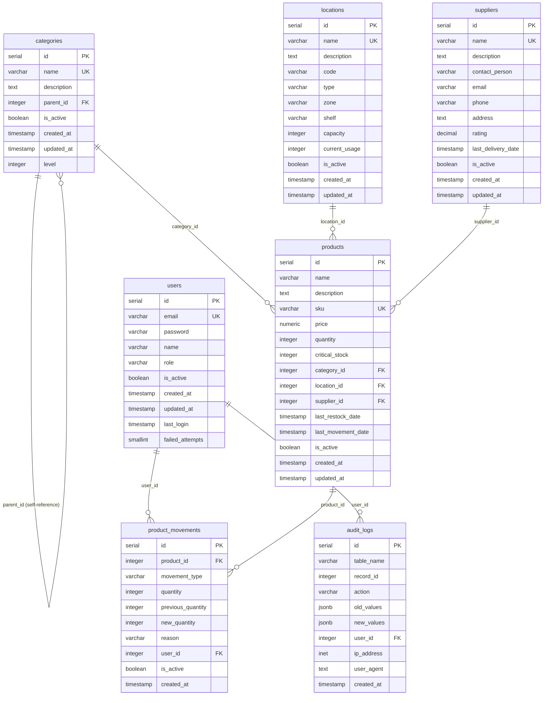

# 🗄️ Esquema de Base de Datos - Sistema de Inventario Industrial

## 📊 Diagrama UML del Esquema

## 🏗️ Estructura de las Entidades

### 👥 **Users** (Usuarios)
- **Propósito:** Gestión de usuarios y autenticación
- **Roles:** ADMIN, USER, VIEWER, MANAGER, SUPERVISOR, AUDITOR
- **Características:** Control de intentos fallidos, último login

### 📂 **Categories** (Categorías)
- **Propósito:** Clasificación jerárquica de productos
- **Características:** Auto-referencia para estructura de árbol
- **Niveles:** Soporte para categorías padre-hijo

### 📍 **Locations** (Ubicaciones)
- **Propósito:** Gestión de almacenes y ubicaciones físicas
- **Características:** Control de capacidad y uso actual
- **Tipos:** WAREHOUSE, STORAGE, etc.

### 🏢 **Suppliers** (Proveedores)
- **Propósito:** Gestión de proveedores y contactos
- **Características:** Sistema de rating, información de contacto
- **Validación:** Formato de email

### 📦 **Products** (Productos)
- **Propósito:** Gestión del inventario principal
- **Características:** SKU único, stock crítico, precios
- **Relaciones:** Categoría, ubicación, proveedor

### 🔄 **Product Movements** (Movimientos)
- **Propósito:** Auditoría de movimientos de stock
- **Tipos:** IN, OUT, ADJUSTMENT
- **Particionamiento:** Por fecha (mensual)

### 📋 **Audit Logs** (Logs de Auditoría)
- **Propósito:** Trazabilidad completa de cambios
- **Características:** JSONB para valores antiguos/nuevos
- **Particionamiento:** Por fecha (mensual)

## 🔧 Optimizaciones Implementadas

### 📈 **Índices**
- **Búsqueda por texto:** Trigram indexes para nombres
- **Índices parciales:** Solo registros activos
- **Índices compuestos:** Para consultas frecuentes
- **Índices INCLUDE:** Para consultas eficientes

### 🗂️ **Particionamiento**
- **product_movements:** Particiones mensuales (2024-2026)
- **audit_logs:** Particiones mensuales (2024-2026)
- **Beneficios:** Mejor rendimiento en consultas históricas

### 📊 **Vistas Materializadas**
- **mv_critical_stock_products:** Productos en stock crítico
- **mv_category_tree:** Estructura jerárquica de categorías
- **mv_product_stats:** Estadísticas de productos

### 🔄 **Triggers y Funciones**
- **Auditoría automática:** Todos los cambios se registran
- **Actualización de timestamps:** updated_at automático
- **Funciones de mantenimiento:** Refresco de vistas

## 🛡️ Restricciones y Validaciones

### ✅ **Constraints de Integridad**
- **Claves únicas:** email, sku, nombres
- **Validaciones de dominio:** roles, tipos de movimiento
- **Checks de negocio:** precios positivos, cantidades válidas

### 🔒 **Seguridad**
- **Encriptación:** Contraseñas con bcrypt
- **Control de acceso:** Roles granulares
- **Auditoría:** Trazabilidad completa

## 📋 **Datos de Ejemplo**

El sistema incluye datos iniciales para:
- Usuario administrador por defecto
- Categorías básicas (Sensores, Transmisores, Válvulas, etc.)
- Ubicaciones de almacén
- Proveedores de ejemplo
- Productos industriales de muestra

---

**🎯 Este esquema está optimizado para:**
- **Escalabilidad:** Particionamiento y índices
- **Rendimiento:** Vistas materializadas y consultas optimizadas
- **Auditoría:** Trazabilidad completa de cambios
- **Flexibilidad:** Estructura jerárquica de categorías
- **Seguridad:** Control de acceso granular 